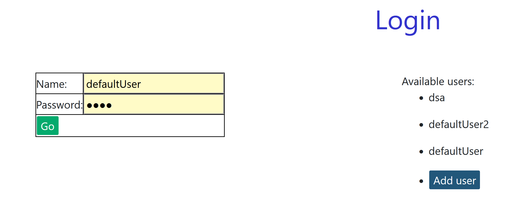
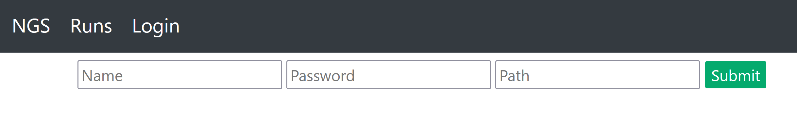
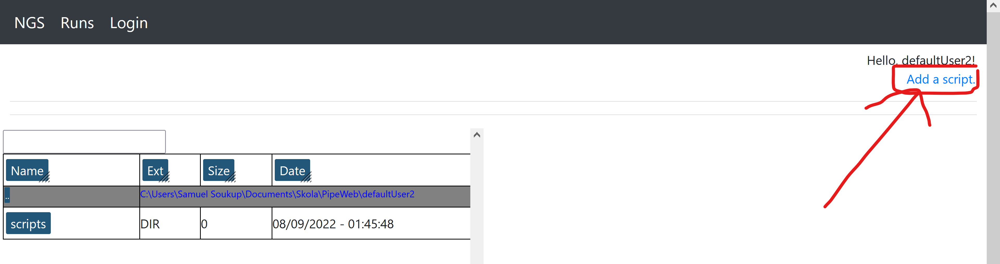
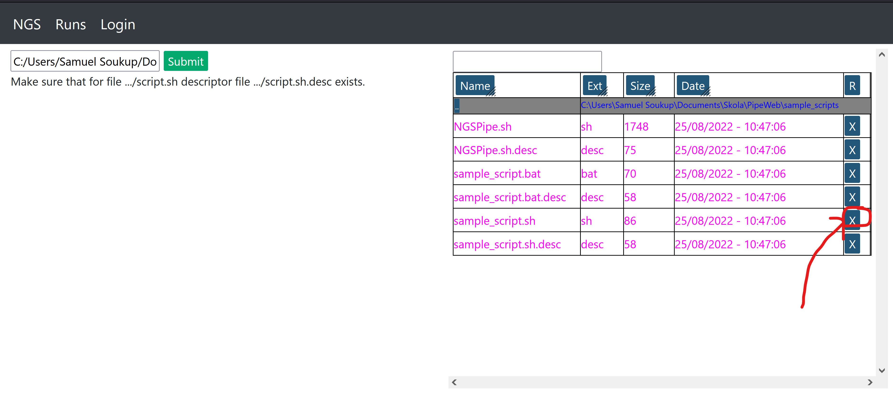
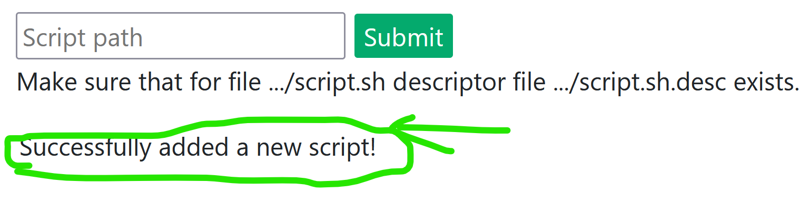
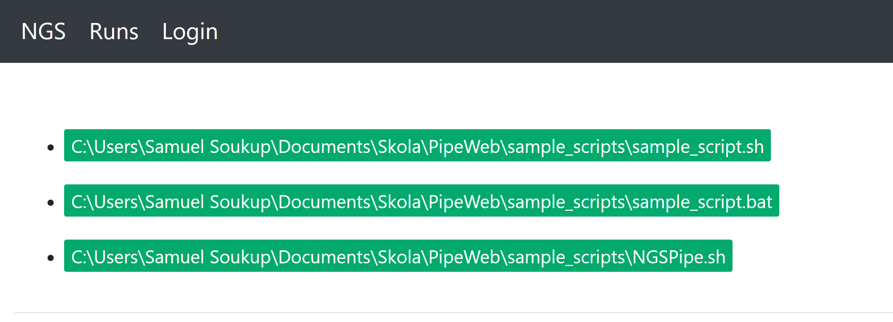
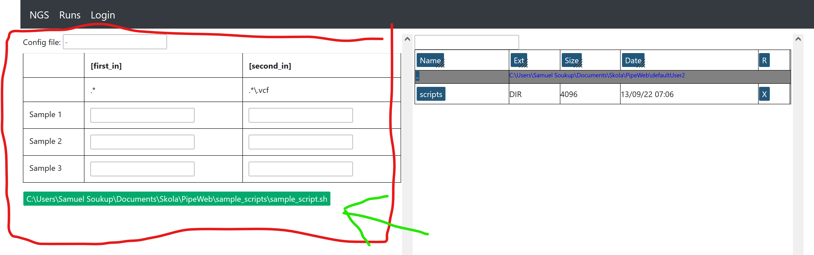
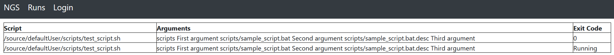

# NGS Pipe web

## On Windows clone this repository via

```shell
git clone https://github.com/eleniel-mocna/PipeWeb --config core.autocrlf=input
```

This is a try for a web frontend for the
[Nextgen Pipe Shell project](https://github.com/eleniel-mocna/nextgen_pipe).
For more information read the README that is there. There is a tl;dr in the next section.

The main focus of this app was to create a web page
that will require minimal maintenance, therefore no big
libraries are used (both in java and js sides).

### Nextgen Pipe

The Nextgen Pipe provides a shell interface for usage of bioinformatics tools for
NGS (new generation sequencing) pipelines. The pipeline is then a bash script
which has the following arguments:

- A config file with not often changing configuration
- N-ths of arguments for N samples (arguments are mostly filenames).

E.g. Let's say we've got a script `say_hi_to_two_people.sh`.
To use it we can run the following command:

```shell
say_hi_to_two_people.sh /configs/config_file.sh resultFile Ester Peter
```

Where `/configs/config_file.sh` might look like this:

```shell
say_hi_to_two_people_HELLO="Hello and welcome, "
```

And get contents of `result_file` of:

```
Hello and welcome, Ester, Peter.
```

## Run

To run this program, it is recommended to run it from docker
because the initial setup will be done automatically. But it still should
work on any linux machine.

### Docker

Use the IntelliJ Docker build
or run the following commands from the terminal.

```(shell)
$ docker build -t pipe_web .
$ docker run -p <empty_port>:8080 pipe_web
```

### Maven

```
$ mvn spring-boot:run
```

## Functionality

### Login

After starting the app you can access only the login page.
Here you can log in to an existing account or add a user
(because this app should be run only in
secure networks with only trusted people having
access, this shouldn't be a problem).

For the defaultUser the password is `1234`.

### Adding a user

At the login page you can also add a user by clicking
the `Add user` button.

Here you can enter the user's name, password and path
to his root folder.

### User folder structure

Each user has his own folder, where he can store
all needed data, also there is a `scripts` folder
in which all of his scripts are saved.

### Adding your first script

After logging in you'll see a file explorer in your
root folder. And in the right upper corner you can
add a script:

Here you will see a file manager in which
you can navigate to the script you want to add
and press X to fill in the form on the left.

Now just submit the path and the script
will be added.


## Running the script

Now you can go back to the home screen
(by hitting the NGS button in the
left upper corner).
Here choose the script you want to run:


Then you will get the arguments' menu. Here you can specify the
config file and the arguments. You can fill these by hand
or by using the `x` buttons in the file manager.
Also hints for files in your root directory will
be provided by the browser.

You can leave the config file empty and the
default config file will be used.

After all arguments are filled in run the script by submitting
the form by the button below the arguments.



This will show you the list of running (and already finished)
scripts:


Here you can see what arguments did the scripts have
and with what exit code they ended.

## Test script

There is a test script available in the sample_scripts folder,
which can be used to test if the script launching works.

## More things that should be added

- Add support for scheduling starts
- Add support for killing processes
- Bring back multi-layer file manager
- Apply predictions for K layers of the file manager
- Add auto-refreshes to RUNs